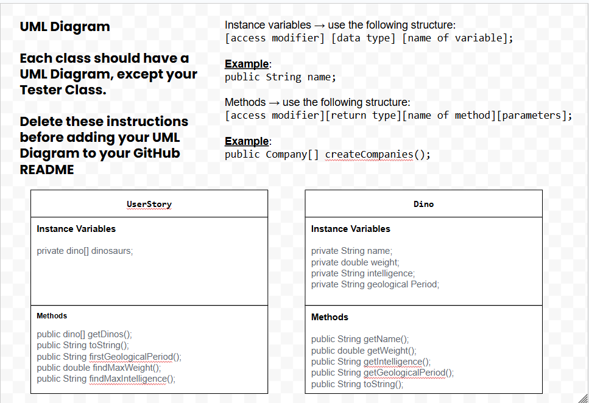

# Data-For-Good
# Unit 3 - Data for Social Good Project

## Introduction

Software engineers develop programs to work with data and provide information to a user. Each user has different needs based on the information they are looking for from data. Your goal is to create a data analysis program for your user that stores and analyzes data to provide the information they need.

## Requirements

Use your knowledge of object-oriented programming, one-dimensional (1D) arrays, and algorithms to create your data analysis program:
- **Write a class** – Write a class to represent your user or business and store and analyze their data with no-argument and parameterized constructors.
- **Create at least two 1D arrays** – Create at least two 1D arrays to store the data that your user needs information about.
- **Write a method** – Write a method that finds or manipulates the elements in a 1D array to provide the information your user needs.
- **Implement a toString() method** – Write a toString() method that returns general information about the data (for example, number of values in the dataset).
- **Document your code** – Use comments to explain the purpose of the methods and code segments and note any preconditions and postconditions.

## User Story 

Include your User Story you analyzed for your project here. Your User Story should have the following format: 

> As an paleontologist ,   
> I want to I want a system that reads dinosaur names, weights, intelligence levels, and geological periods from data sets,  
> so that I can quickly analyze patterns in dinosaur  species and answer scientific questions about their characteristics.

## Dataset 

Include a hyperlink to the source of your dataset used for this project. Additionally, provide a short description of each column used from the dataset, and the data type. 

Heres the Data Set we used

https://docs.google.com/spreadsheets/d/1m5EwVC1I1lSRr3MOyFgAi54RGY6UxpqQoN_dWHXxQ9I/edit?gid=0#gid=0

- **Name** (String) - name of the the dinosaurs

- **Geoglogical Period** (String) - the geoglogical periods of the earth

- **Intelligence** (String) - the intelligence of different dinosaurs

- **Weight** (int) - weight of the the dinosaurs

## UML Diagram 

Put an image of your UML Diagram here. Upload the image of your UML Diagram to your repository, then use the Markdown syntax to insert your image here. Make sure your image file name is one work, otherwise it might not properly get displayed on this README. 

UML Diagram for my project  

## Description 

Write a description of your project here. In your description, include as many vocab words from our class to explain your User Story, the chosen dataset and how your project addressed that users goals. If your project used the Scanner class for user input, explain how the user will interact with your project.

My project lets a paleontologist study dinosaurs using the UserStory class with data from text files. Each dino has variables like name, weight, intelligence, and geologicalPeriod. The Scanner class lets the user choose menu options to analyze the data, such as finding the heaviest or smartest dinosaur and their respective geological periods. For loops and if statements process the arrays to display results.